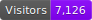

 

  

  

<h1 align="center">Hi!  I'm Abdullokhon, 17 (turning 18 soon! 🎂)</h1>

  

 

<h3 align="center">✅ Full-Stack Developer | Passion for Development 🔥</h3>

  
  

  

---

### 👨‍💻 About Me

💻 I believe code is an art, and I aim to make it both beautiful and efficient.  
Full-Stack Developer with a passion for clean architecture, process automation, and creating elegant solutions.  

- 🌍  Based in **Khujand, Tajikistan**
- 🚀  Currently improving my **Full-Stack** skills (focusing on .NET ecosystem)
- 🐧  Experienced in **Windows** and **Linux** environments (Pop!_OS, Kali Linux, Arch Linux)
- 🎮  When not coding, you can find me clicking heads in CS2 (4:3, 1280x960 is the only way!)
- 🤝  Open to collaborating on exciting projects
- ✨  Love writing clean, scalable code

---

### 📬 Connect with Me

  
  
  
  
  
  
  

---

### 💼 Tech Stack & Tools

  
<strong>🌐 Languages, Frameworks & Engines</strong>

  
  
  
  
  
  
  
  
  
  
  
   
  
    

  
<strong>🧠 Databases, DevOps & Design</strong>

  
  
  
  
  
  
  
    

  
<strong>🛠️ IDEs & Editors</strong>

  
  
  
  
  
  
   
  
    

  
<strong>🖥️ Operating Systems</strong>

  
  
  
  
   
  

---

### 🏆 Achievements & GitHub Overview

  

 

  
  

 

  

 

  

---

### 🧩 LeetCode Stats

  

---

### 😜 Just for Fun

  

---

### 👾 Coding Vibe

  
    
  <em style="color:gray;">Coding in flow... 👨‍💻🎮</em>

<!-- Footer -->

  

